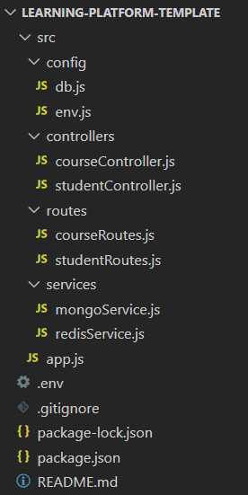
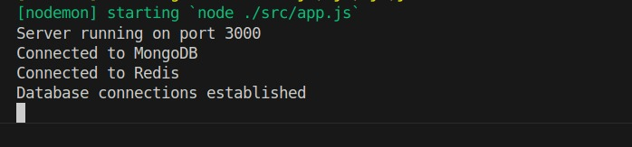

# Projet de fin de module NoSQL

Dans ce projet, j'ai créé une API simple qui servira de backend pour une plateforme d'apprentissage en ligne.

## Comment configurer le projet dans votre environnement local ?

1. Configuration de votre environnement local :

   ```bash
   # Clonez mon dépôt template (ce dépôt)
   git clone https://github.com/widad-banane/learning-platform-template.git

   # Renommez le dépôt origin
   cd learning-platform-template
   git remote remove origin

   # Ajoutez votre dépôt comme nouvelle origine
   git remote add origin https://github.com/[votre-compte]/learning-platform-nosql

   # Poussez le code vers votre dépôt
   git push -u origin main
   ```

2. Installation des dépendances :

   ```bash
   npm install
   ```

3. Démarrer le projet :

   ```bash
   npm run start

   ```
## Structure de projet:


- Le dossier `src` contient tout le code de mon projet.
- `app.js` sert à démarrer mon API.
- Le dossier `config` contient les fichiers de configuration pour la connexion à MongoDB et Redis, ainsi que le fichier `.env` (qui contient des informations sensibles sur la base de données : MongoDB et Redis).
- Le dossier `controllers` contient les fichiers de contrôleurs qui gèrent la logique des entités `course` et `student`.
- Le dossier `routes` définit les routes pour `course` et `student`.
- Le dossier `services` est responsable de la communication avec la base de données : insertion, mise à jour, suppression, affichage et gestion du cache.
## Choix des Technologies:
- Node.js et Express : Technologies utilisées pour développer un serveur backend performant, rapide et flexible.
- MongoDB : Base de données NoSQL choisie pour stocker et gérer les données de manière efficace.
- Redis : Utilisé pour implémenter un système de cache performant, optimisant l'accès aux données fréquemment utilisées.
- Postman : Outil utilisé pour tester et valider les endpoints de l'API.

## Questions et Réponses :

### Question : Pourquoi créer un module séparé pour les connexions aux bases de données ?
**Réponse** : Un module séparé améliore la lisibilité et la réutilisabilité du code. Cela permet de gérer les connexions de manière centralisée,de simplifier la maintenance et de respecter les principes de séparation des responsabilités (SRP).

### Question : Comment gérer proprement la fermeture des connexions ?
**Réponse** : Utiliser process.on pour détecter les signaux d'arrêt et appeler les méthodes de fermeture des clients (close(), quit()).

### Question: Pourquoi est-il important de valider les variables d'environnement au démarrage ?
 **Réponse** : Il est crucial de valider les variables d'environnement au démarrage pour garantir la présence et l'exactitude des configurations nécessaires, évitant ainsi des erreurs inattendues et un comportement imprévisible de l'application en production.

### Question: Que se passe-t-il si une variable requise est manquante ?
**Réponse**  : Si une variable requise est manquante, l'application peut ne pas fonctionner correctement, ce qui peut entraîner des erreurs critiques, des pannes ou des comportements inattendus. Il est donc crucial de vérifier et de valider toutes les variables d'environnement nécessaires avant de démarrer l'application. 

### Question: Quelle est la différence entre un contrôleur et une route ?
**Réponse** :Une route est une URL spécifique qui correspond à une action dans l'application, tandis qu'un contrôleur est une fonction qui gère la logique de cette action. Les routes définissent les points d'entrée de l'application, et les contrôleurs traitent les requêtes et renvoient les réponses appropriées

### Question : Pourquoi séparer la logique métier des routes ?
 **Réponse** :Séparer la logique métier des routes rend le code plus modulaire, maintenable et testable, tout en favorisant la réutilisation de la logique dans l'application et en respectant le principe de responsabilité unique.

### Question: Pourquoi séparer les routes dans différents fichiers ?
 **Réponse** : Séparer les routes dans différents fichiers permet de mieux organiser le code, de le rendre plus lisible et plus facile à maintenir. Cela permet également de séparer les préoccupations, en regroupant les routes liées à une fonctionnalité spécifique dans un fichier distinct.

### Question : Comment organiser les routes de manière cohérente ?
 **Réponse**: il est recommandé de regrouper les routes par fonctionnalité ou par ressource. Par exemple, toutes les routes liées aux cours peuvent être placées dans un fichier `courseRoutes.js`, tandis que les routes liées aux utilisateurs peuvent être placées dans un fichier `sudentRoutes.js`. Il est également utile de suivre une convention de nommage cohérente et de documenter les routes pour faciliter la compréhension et la maintenance du code.

 ### Question: Pourquoi créer des services séparés ?
 **Réponse**: La création de services indépendants dans une architecture facilite le découplage, ce qui simplifie l'évolution de chaque service, réduit l'impact des pannes et améliore la scalabilité en optimisant l'allocation des ressources.

### Question : Comment gérer efficacement le cache avec Redis ?
**Réponse** :Utilisez des TTL pour expirer les données obsolètes et éviter la surcharge de mémoire, ainsi que des clés structurées pour faciliter la gestion et la récupération des données.

### Question: Quelles sont les bonnes pratiques pour les clés Redis ?
**Réponse** :Utilisez des noms de clés descriptifs et structurés, comme "object:id:field", pour faciliter la gestion et la recherche. Évitez les clés longues et veillez à leur unicité pour prévenir les collisions.

### Question: Comment organiser le point d'entrée de l'application ?
**Réponse** : Organisez le point d'entrée de l'application en définissant un fichier principal (comme `app.js`) qui initialise l'application, configure les routes, les middlewares et les connexions aux bases de données, et démarre le serveur. Ce fichier peut aussi gérer l'arrêt de l'application en écoutant les signaux de terminaison.

### Question: Quelle est la meilleure façon de gérer le démarrage de l'application ?
**Réponse** : La meilleure méthode consiste à décomposer le processus de démarrage en fonctions modulaires, puis à les exécuter séquentiellement dans le fichier principal (par exemple, `app.js`). Cela améliore la lisibilité et la maintenabilité du code. Il est également crucial de gérer les erreurs correctement et de suivre les bonnes pratiques pour les connexions aux bases de données.

## Captures d'écran


#### Bon courage